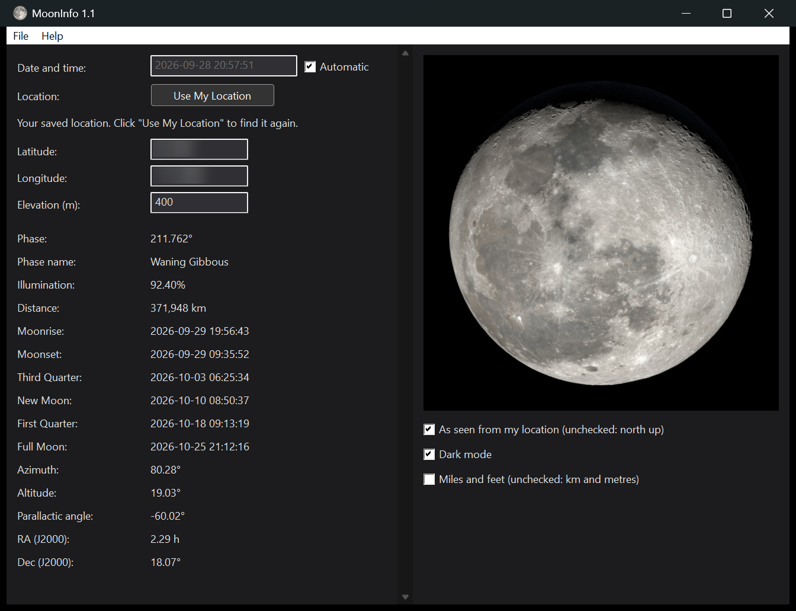

# MoonInfo

The Moon's phase, illumination, distance, rise and set, the next quarters
and its position in the sky, updated every second, with a picture of the
Moon as it looks from your location. A Windows version of the Moon Info web
page.

## Download

Get **MoonInfo-1.2-win64.zip** from the
[Releases page](../../releases) and unzip it anywhere:

    MoonInfo.exe   the program (no installation; no DLLs needed)
    images\        the Moon pictures (keep this folder beside MoonInfo.exe)

Windows 10 or 11, 64-bit. On Linux or macOS it runs under
[Wine](https://www.winehq.org/) (which has no Windows location service, so
it finds the location from your internet address).

## Using it

- **Date and time:** with *Automatic* checked, the computer's clock: every
  value is recalculated each second. Unchecked, type a local date and time,
  `YYYY-MM-DD HH:MM:SS`.
- **Location:** on the first run MoonInfo finds your location, and *Use My
  Location* finds it again. It asks Windows' location service first (if it's
  turned on for desktop apps in Settings > Privacy > Location), then, if
  that's off or doesn't answer, looks up the approximate location of your
  internet address at [ipinfo.io](https://ipinfo.io). Or type the latitude
  and longitude (degrees, north and east positive) and the elevation.
- **Phase name:** New Moon, Waxing Crescent, First Quarter, Waxing Gibbous,
  Full Moon, Waning Gibbous, Third Quarter or Waning Crescent (the four
  principal phases within about half a day of the exact time).
- **Distance:** from the Earth's center to the Moon's.
- **Picture:** *As seen from my location* turns the picture by the Moon's
  parallactic angle (the angle between celestial north and straight up at
  the Moon), so it's tilted as it appears in your sky, roughly upside down in
  the southern hemisphere. Unchecked, it's shown north up.
- **Miles and feet:** the distance in miles and the elevation in feet
  (unchecked: km and metres).
- **Dark mode:** light text on a dark window, with a dark title bar. On the
  first run it follows Windows' app theme.
- The picture grows and shrinks with the window. If the window is too short
  for all the data, scroll it with the scroll bar or the mouse wheel.

Times are in the computer's time zone. Settings are kept in
`%APPDATA%\MoonInfo\settings.ini`.

## Building

Visual Studio 2019 (x64) and CMake:

    cmake -S . -B build -G "Visual Studio 16 2019" -A x64
    cmake --build build --config Release

Plain Win32, with the Windows 10 SDK 10.0.19041 (for C++/WinRT's
`Windows.Devices.Geolocation`); no other libraries. The images aren't in
this repository: copy the `images` folder from the release zip into the
project folder, and the build copies it beside `MoonInfo.exe`.

`build/Release/mooninfo-test.exe` prints the calculations for a time and
place (`mooninfo-test <unix seconds> <latitude> <longitude>`), or tests
finding the location (`mooninfo-test location`).

## Support and contact

MoonInfo is free, open-source software provided as is: no support, no
warranty. You're welcome to fork it and change it.

To get in touch (questions, ideas, or just to say hello), post in
[Discussions](https://github.com/ferrellsl/MoonInfo/discussions).

## License and credits

MoonInfo: MIT license, (c) 2026 Steve Ferrell ([LICENSE](LICENSE)).

- Calculations: [Astronomy Engine](https://github.com/cosinekitty/astronomy),
  (c) 2019-2023 Don Cross (MIT license).
- Moon images: NASA's Scientific Visualization Studio.

See [THIRD-PARTY-NOTICES.txt](THIRD-PARTY-NOTICES.txt) for details.
